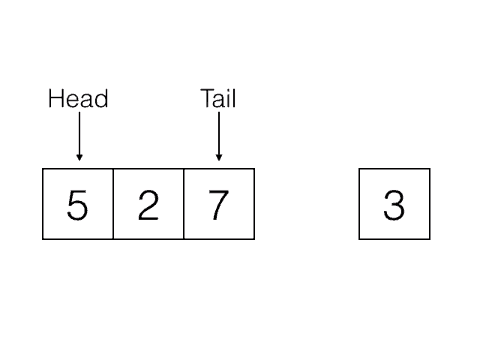
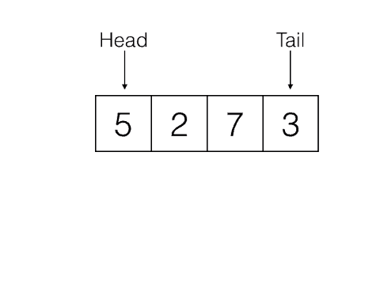

# queue
Simple queue module

A trivial queue that only does that it needs with unit tests.

# Purpose 
Make a test task

# key points

- Pure C code
- Minimal dependency
- Fully functional code

#

 